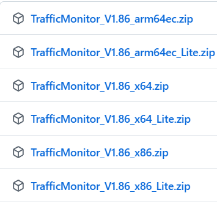
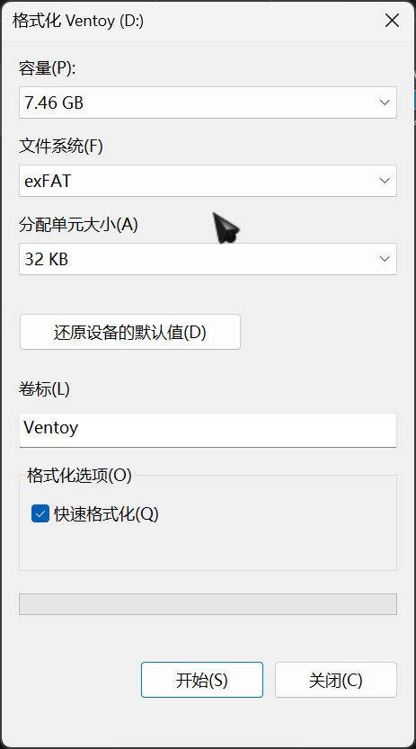
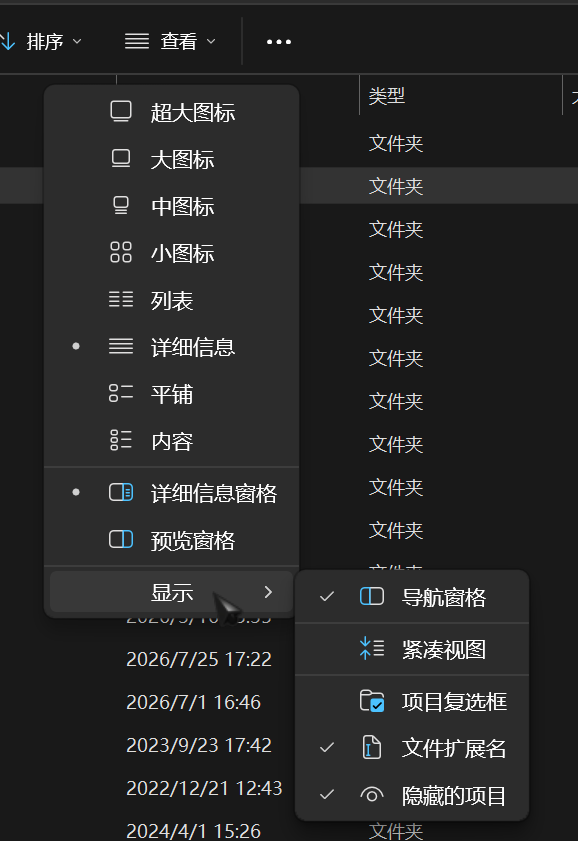

# 操作系统与文件系统

操作系统负责统一协调硬件与软件之间的通信；文件系统决定了数据在硬盘上如何存储和读取。操作系统建立在文件系统上

---

## 操作系统

操作系统（Operating System / OS）是运行在硬件之上，管理所有软件和资源的核心程序。操作系统本身也是软件，从某些角度上来讲和其他软件没区别

日常常见操作系统：

| 操作系统      | 常见场景                 | 特点             |
| ------------- | ------------------------ | ---------------- |
| Windows 11/10 | 大部分个人电脑           | 兼容性强         |
| macOS         | MacBook、Mac mini        | 好看，稳定       |
| Linux         | 服务器、嵌入式、个人电脑 | 开源免费，高定制 |
| Android/iOS   | 手机、平板               | 移动端           |

> [!NOTE]
> 本文中的操作系统默认为 **Windows**，且只对 Windows 做稍微详细的介绍

### Windows 版本

目前主流 Win 版本：

| 版本       | 发布年份 |
| ---------- | -------- |
| Windows 7  | 2009     |
| Windows 10 | 2015     |
| Windows 11 | 2021     |

目前最新的 Win11 子版本为 26H2（2026年7月25日）

> [!TIP]
> 按 `Win + R` 输入 `winver` 回车，可以快速查看当前 Windows 的版本号和内部版本信息。
> 同样的输入 `msinfo32` 可以获取更多系统、硬件信息

### 32 位与 64 位

操作系统软件和普通软件都可以分为 32 位与 64 位

老机器或早期系统，只能运行 32 位程序，且内存上限为 4 GB，现在几乎所有电脑出厂都是 64 位 Windows，可以运行 32 位和 64 位的程序

除非是真的很老的电脑，不用担心这个问题。如果在装软件的时候有提供 32 位与 64 位的版本，直接选 64 位就可以了，64 位的软件性能更好

当然这里说的都是以 x86 和 x86-64 架构为基础的，除此之外还有 ARM 架构， RISC 架构等等，还有许多细节可以区分，本文就不介绍了

举一个具体例子：



对于这个绿色软件，末尾的 `x86`、`x64`、`arm64ec` 分别代表了 32 位软件、64 位软件、ARM 64 位软件

> [!TIP]
> 按照规范，64 位安装型软件[^1]应该安装在 `Program Files` 文件夹中，32 位安装型软件应该安装在 `Program Files (x86)` 文件夹中，64 位 Win 系统中对应的 32 位兼容资源存放在 `C:\Windows\SysWOW64`

> [!TIP]
> 更深的知识：上面提到的架构都是指令集架构，其实 x86 和 x64 是不同的架构，在这里便于理解表达为 32 位和 64 位
> 普遍来讲 x86 表示的是 Intel 发布的 32 位架构，x64 或 x86-64 表示的是 AMD 发布的 64 位架构

---

## 文件系统

文件系统是操作系统管理磁盘数据的规则，决定了文件在物理层面是如何存放的，不同文件系统格式之间是不互通的

常见的文件系统格式：

| 格式  | 常见用途         | 单文件大小上限 | 操作系统支持                                       |
| ----- | ---------------- | -------------- | -------------------------------------------------- |
| NTFS  | Windows 卷       | 理论无上限     | Windows 原生；macOS 只读；Linux 最新内核原生可读写 |
| FAT32 | U 盘、老设备兼容 | **4 GB**       | Windows / macOS / Linux 均支持                     |
| exFAT | U 盘             | 理论无上限     | Windows / macOS / Linux 均支持                     |
| ext4  | Linux 卷         | 理论无上限     | Linux 原生；Windows 需额外工具                     |
| APFS  | macOS 卷         | 理论无上限     | 苹果设备原生；Windows 基本不支持                   |

U 盘首选 exFAT 而不是 FAT32，只在 BIOS Flash 等特殊情况下使用 FAT32

### 格式化卷

这里仅介绍使用 Win 自带工具的最简方法

- 格式化现有硬盘
    1. 打开"此电脑"，右键需要格式化的卷 → 选择**格式化**
    2. 选择目标文件系统，分配单元大小保持默认，卷标可以自己修改
    3. 勾选**快速格式化**，点击**开始**
    4. 完成格式化
- 格式化全新硬盘
    1. 打开磁盘管理，可以使用快捷键 `Win + X` + `K`
    2. 右键需要创建卷的硬盘，**新建简单卷**
    3. 选择目标文件系统，卷标可以自己修改，其他设置都保持默认
    4. 完成创建

> [!TIP]
> "快速格式化"就如其字面意思一样，是快速的格式化，仅仅重构文件系统元数据，具体文件在短时间不写入数据的情况下可以恢复；如果不勾选快速格式化，会重建文件系统、扫描坏扇区、用零覆盖全部数据区，消耗时间较长，如果是固态硬盘也会增加更多的写入量，平时使用快速格式化即可



~~由于我手边没有多于的硬盘没法演示格式化全新硬盘~~

### 磁盘分区与盘符

Windows 中，每个磁盘分区都会被分配一个盘符（如 C:、D:、E:）。C 盘是 Windows 的系统盘，系统文件都在这里，默认情况下软件也会安装到这个盘，缓存也会放在这个盘，默认情况下页面文件也会放在 C 盘。

> [!WARNING]
> 页面文件对于 Win 是不可缺少的！！！不要相信网络上“物理内存足够多就可以关闭页面文件”的荒唐理论！！！

盘符和硬件硬盘并不是固定映射！！！

**所有软件**的默认缓存、配置存放文件都是在 C 盘，不要认为软件装在 D 盘软件就不会往 C 盘写入文件了！！！这是很正常的思维，因为只有 C 盘是唯一确定肯定存在的盘，所以许多程序的默认工作空间都是 C 盘

对于要不要分盘，分盘的话每个盘分多少，没有答案。**按照自己的习惯设置**，我个人倾向于在总空间足够的情况下 C 盘在 200GB - 300GB 为宜，其他的按照自己的情况来。

> [!TIP]
> 一些计算机老资历可能倾向于分很多区，这在现代是没有必要的，原因如下

硬盘分区在现代的主要作用是隔离文件系统，让一个硬盘上可以存在多种文件系统。
如果你仍在使用 HDD（机械硬盘），分区能让你更好的管理各个部分的读写性能，越靠前的分区在物理层面上越靠近盘片外围，根据小学三年级学习过的物理知识，易知在同一转速下，盘片上越靠外的质点线速度越大，同一时间能被磁头读取的次数也越多，理论读写性能越强。这也是为什么以前电脑分这么多区的原因，只是便于管理性能罢了，至于对文件进行分类，文件夹就能做到。现在的笔记本硬盘都是固态硬盘，分很多区没什么意义

---

## 文件路径

Windows 中用反斜杠 `\` 分隔路径（其实使用正斜杠也行，会自动转换的），例如：

```
C:\Users\username\Documents\report.docx
```

macOS 和 Linux 用正斜杠 `/` 分隔：

```
/home/username/Documents/report.docx
```

Win 中的常用特殊路径：

| 路径符号              | 含义                                                         |
| --------------------- | ------------------------------------------------------------ |
| `C:\Users\%USERNAME%` | 当前用户的主目录（默认情况下桌面、文档、下载都在此文件夹中） |
| `%APPDATA%`           | 应用程序数据目录（许多软件的配置文件在这）                   |
| `%TEMP%`              | 系统临时文件目录                                             |

> [!TIP]
> 在文件资源管理器的地址栏直接输入 `%APPDATA%` 或 `%TEMP%` 回车，可以快速跳转到对应目录，输入本地账户的账户名也可以直接跳转到用户目录

---

## 隐藏文件与文件扩展名

Windows 默认不显示文件扩展名和系统隐藏文件，电脑小白注意甄别。
比如下载了一个"PDF"，其实是 `report.pdf.exe` 的可执行程序

### 开启文件扩展名显示

1. 打开文件资源管理器
2. 点击顶部菜单**查看**
3. 勾选**文件扩展名**（Windows 11 在"显示"子菜单中）

### 显示隐藏文件

同上



> [!WARNING]
> 系统隐藏文件不要随意删改，误删可能导致系统无法正常运行。

---

## 回收站与永久删除

- 按 `Delete` 键删除的文件会进入**回收站**，可以还原
- 按 `Shift + Delete` 会**绕过回收站**，直接永久删除，无法通过回收站还原

> [!WARNING]
> 谨慎使用 `Shift + Delete`！！！给自己留一条后路！

---

## 常见问题

### U 盘插上后电脑没反应

1. 换一个 USB 接口试试
2. 打开磁盘管理，看 U 盘有没有出现但没有盘符
3. 如果出现了但没盘符，右键分区，**更改驱动器号和路径** ，分配一个字母；如果没发现 U 盘，大概率是挂了；如果磁盘管理卡住了，换一个接口，重启试试，如果还是不行，大概率是挂了

### 文件或目录损坏且无法读取

可能是文件系统出错，可以尝试修复：

> [!IMPORTANT]
> 此方法可能会使文件彻底损坏，这个方法修复的是文件系统本身而不是文件！！！物理上损坏的文件是救不回来的

- 右键出问题的磁盘，属性，工具，检查
- 或者用管理员权限打开命令提示符，输入：

    ```cmd
    chkdsk D: /f /r
    ```

    其中 `D:` 替换为出问题的盘符，`/f` 修复错误，`/r` 扫描坏扇区。

### C 盘满了

C 盘空间不足会导致系统变慢，常见清理方式：

| 原因                     | 解决方式                                                                                           |
| ------------------------ | -------------------------------------------------------------------------------------------------- |
| 系统更新残留文件         | 搜索打开磁盘清理，勾选"以前的 Windows 安装"                                                        |
| 临时文件积累             | `Win + R` 输入 `%TEMP%`，全选删除                                                                  |
| 软件默认装到 C 盘        | 装软件时手动更改安装路径到 D 盘                                                                    |
| 个人文件堆积             | 清理下载文件夹中不需要的文件，清理 QQ 微信等软件接收的不需要文件，将 QQ 微信的聊天记录文件进行迁移 |
| 休眠文件（hiberfil.sys） | 管理员命令提示符运行 `powercfg -h off`（关闭休眠，会使快速启动失效，笔记本会减少一点外出续航）     |
| 页面文件（pagefile.sys） | 可迁移到 D 盘，但不建议新手操作，不要关掉！！！                                                    |

> [!TIP]
> 这里只是列举一些简单的不需要额外工具的方式，更具体的操作和方法见[磁盘清理与释放空间](../Disk/Cleanup.md)章节

[^1]: 安装型软件即需要安装后再使用的软件，解压就能用的软件可以叫做绿色软件，不是安装型软件
