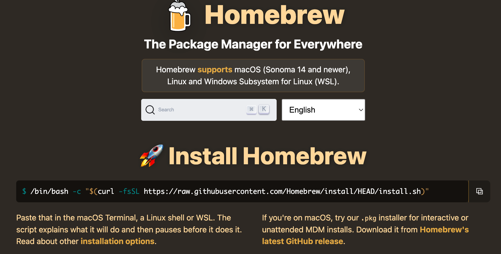
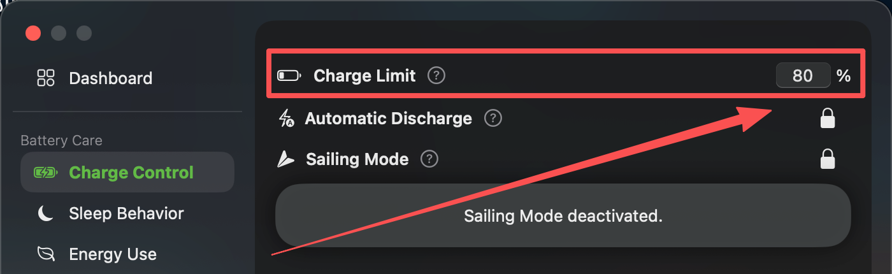
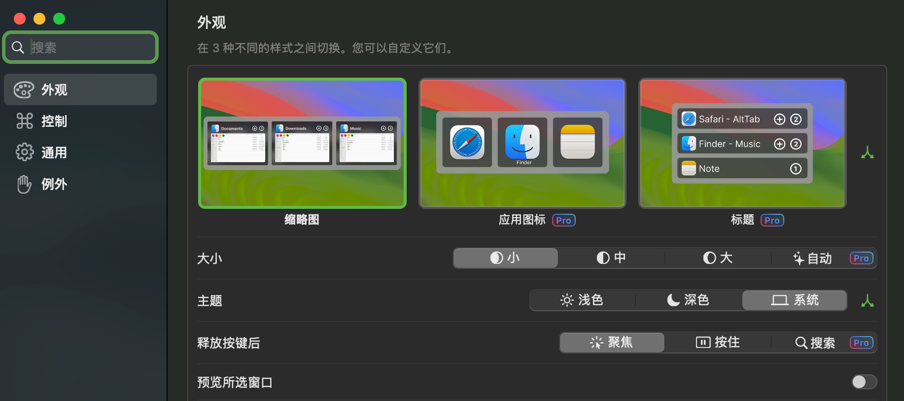
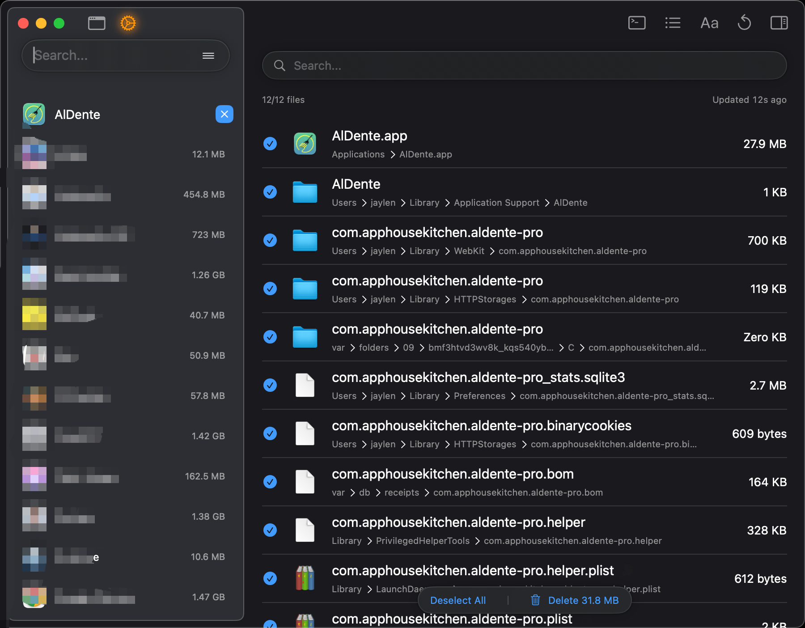

# Win 常用工具推荐

## Office Tool Plus

[Office Tool Plus](https://www.officetool.plus/zh-cn/) 一个强大而高效的 Office 部署软件

### 为什么推荐

- 完全免费，傻瓜式操作，版本多样
- 可以自定安装位置，自选需要安装的应用程序
- 下载方便，可以通过镜像站下载，也可以直接使用 power shell 下载命令

### 使用步骤

1. 访问 [Office Tool Plus 官网](https://www.officetool.plus/zh-cn/)，点击开始，在介绍栏中找到下载并使用，选择任意镜像站，根据系统架构选择对应文件下载（不确定的话选 x86 版本，兼容性最好）。或者直接使用 power shell 下载命令（irm https://officetool.plus | iex）
2. 下载完成后，请将整个压缩包解压到一个合适的位置，例如桌面。请勿在压缩包内直接双击运行 Office Tool Plus.
3. 双击 Office Tool Plus.exe 以运行程序
4. 打开软件后，点击部署，在部署 Office 下拉菜单中进行配置，部署模式选择安装，体系结构选择对应（通常 64 位），然后在添加产品选择需要的 Office 版本（建议选择 2024 标准版），语言选择简体中文，然后在应用程序中把不需要的程序取消勾选（例如大多数人用不到 OneDrive、Outlook 和 OneNote）。全部完成后，回到最上方，点击开始部署
5. 激活：Office 安装完成后需要激活，可参考 [Microsoft Activation Scripts](https://github.com/massgravel/Microsoft-Activation-Scripts) 仓库的说明进行操作

---

## 图吧工具箱

[图吧工具箱](https://www.tbtool.cn/) 是一套免费的硬件检测与系统诊断工具合集，集成了 CPU-Z、GPU-Z、AIDA64、CrystalDiskInfo、DisplayX 等常用工具，方便快速排查电脑硬件问题。

### 为什么推荐

- 一个软件打包了数十款常用硬件工具，免去逐个下载的麻烦
- 绿色免安装，解压即用，U 盘随身携带方便
- 硬件检测、屏幕测试、磁盘健康、温度监控一应俱全

### 常用功能

| 工具            | 用途                                   |
| --------------- | -------------------------------------- |
| CPU-Z           | 查看 CPU、内存、主板详细信息           |
| GPU-Z           | 查看显卡型号、显存、驱动版本           |
| CrystalDiskInfo | **查看硬盘健康状态**（S.M.A.R.T 信息） |
| AIDA64          | 系统稳定性测试、硬件信息导出           |
| DisplayX        | 屏幕坏点检测、显示器色彩测试           |
| HWMonitor       | 监控 CPU/显卡温度、风扇转速            |

### 使用场景

- **电脑卡顿排查**：用 HWMonitor 查看温度是否过高，用 CrystalDiskInfo 检查硬盘是否即将故障
- **购机验机**：全新/二手电脑到手后，用 DisplayX 检测屏幕坏点，用 CPU-Z 核对配置是否与描述一致
- **蓝屏分析**：用 AIDA64 进行稳定性压力测试，定位硬件故障

### 注意事项

- 部分工具（如 AIDA64 压力测试）会占用大量系统资源，测试时请注意散热，同时记得接入电源适配器，保证性能完全释放
- 请从官网下载，避免使用第三方下载站，防止捆绑软件

---

## 建议

- **下载任何软件，优先选择官网**，避免从 xx 软件园、xx 下载站 等第三方渠道下载
- 安装过程中注意取消勾选捆绑的附加软件

---

# Mac 常用工具推荐

## Homebrew

### 为什么推荐

- 统一管理软件：安装、升级、卸载都能用命令完成
- 开发环境友好：Git、Python、Node、Go、FFmpeg 等工具都能快速安装
- 自动处理依赖：不用手动找库、配路径



### 终端安装

```bash
/bin/bash -c "$(curl -fsSL https://raw.githubusercontent.com/Homebrew/install/HEAD/install.sh)"
```

### 官网地址

[Homebrew: The Package Manager for Everywhere](https://brew.sh/)

---

## AIdente--充电保护

### 为什么推荐

- 锂电池充到接近 100%时，单节电芯电压比较高。长期维持在这种高电压状态，会加速电解液副反应以及电极材料老化
- AIdente 可以控制电池充电上限，防止插电办公时电池长时间处于高电量



### 官网地址

[AlDente - AppHouseKitchen](https://apphousekitchen.com/aldente-overview/)

---

## Alttab--窗口管理

### 为什么推荐

对于 Win 切换到 Mac 的小伙伴可能不习惯 Mac 的窗口管理方式（Mac 的 command+Tab 本质上是切换软件，不是切换窗口）

原 command+tab 不习惯的点：

- 切换的是软件
- 缩小窗口和隐藏窗口不能隐藏
- 无窗口软件不能隐藏
- 相同软件多个窗口在切换栏里只会显示一个
- 不同桌面的同一个之前的软件在切换栏里没有隔离

Alttab 实现：
alt + tab+多桌面 -> 触控板滑动切换丝滑



### 官网地址

[AltTab Pro — 尽览每个窗口，瞬间完成切换](https://alt-tab.app/)

---

## Pearclearner

### 为什么推荐

- 卸载更彻底：删除 App 的同时清理配置、缓存和支持文件
- 可以帮助快速定位到相关文件的缓存/数据文件位置，方便清理
- 轻量开源：界面简洁，功能专注，适合替代一些更重的清理工具
  

### 安装：

```bash
brew install --cask pearcleaner
```

### 官网

[Pearcleaner — Free Mac App Uninstaller for macOS](https://pearcleaner.com/)
